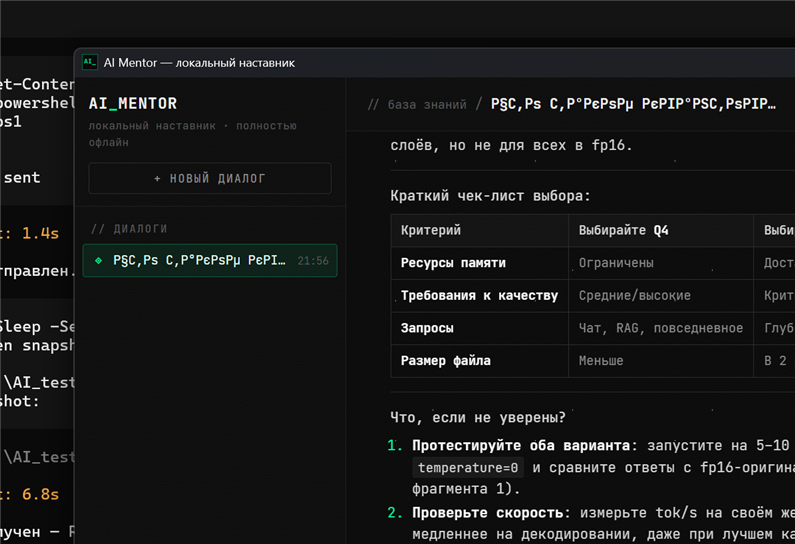

# AI Mentor

**EN** | [RU](README.ru.md)


A fully offline desktop AI mentor for LLM-engineering beginners: RAG over a
local Qdrant + GGUF inference via llama.cpp on your NVIDIA GPU. Nothing
leaves your machine — not your questions, not the knowledge base, not the
generation.



## ✨ Highlights

- **One-click install** — the MSI ships everything: CUDA runtime, cuBLAS,
  ONNX Runtime, Qdrant and the knowledge base. The only download is the
  GGUF model, done by the built-in downloader with one button.
- **Zero cloud** — embedding, retrieval and generation are 100% local.
- **Streaming reasoning** — the model's `<think>` block streams live in a
  collapsible pane; the final answer renders token by token.

## 🖥 Tech Stack

| Layer | Technology |
| --- | --- |
| Shell | Tauri v2 (Rust + system WebView2) |
| Core | Rust crate `mentor-core` |
| Inference | llama.cpp (`llama-cpp-2`) on CUDA 12, KV Q4_0 + FlashAttention |
| Vector DB | Qdrant 1.19 (gRPC), running as a Tauri sidecar |
| Embeddings | intfloat/multilingual-e5-small via fastembed (ONNX) |
| Frontend | Vanilla HTML/CSS/JS, markdown-it + DOMPurify (CSP `default-src 'self'`, hardened with `object-src 'none'; base-uri 'none'; frame-ancestors 'none'`) |

## 📦 Installation

### Users

1. Download `ai-mentor-1.1.0-x64.msi` from the
   [Releases page](https://github.com/FesarovFedor/ai-mentor/releases/latest).
2. Install it (everything is inside — no CUDA Toolkit, no Qdrant setup,
   no config editing).
3. Run **AI Mentor**. On first launch the app starts its own Qdrant,
   provisions data into `%APPDATA%\ai-mentor` and offers to download the
   GGUF model — the URL is prefilled, just press the download button.

### Developers

```powershell
git clone https://github.com/FesarovFedor/ai-mentor.git
cd ai-mentor
cargo tauri build
```

`build.rs` downloads binary dependencies automatically (official sources,
SHA-256 verified, cached in `target/deps_cache/`). See
[CONTRIBUTING.md](CONTRIBUTING.md).

## 📋 System Requirements

- Windows 10/11 x64
- NVIDIA GPU with 8+ GB VRAM and a recent driver — **CUDA Toolkit is NOT
  required** (the app bundles the CUDA runtime; the driver alone provides
  `nvcuda.dll`)
- ~8 GB disk: app (~1.1 GB) + model (~2.7 GB) + headroom

If no NVIDIA driver is detected, inference is blocked with a friendly
message linking to [nvidia.com/drivers](https://www.nvidia.com/drivers) —
the app does not silently fall back to a minutes-per-token CPU mode.

## 🏗 Architecture

Rust workspace: `mentor-core` (config, RAG, inference, generator,
downloader) + `src-tauri` shell (commands, Qdrant sidecar lifecycle,
first-run provisioning, driver pre-flight). Qdrant starts automatically on
a free port and is stopped when the app exits.

Deep dive: [docs/ARCHITECTURE.md](docs/ARCHITECTURE.md) — module map,
request flow, key invariants and the L3–L5 design decisions.

## 📊 Benchmarks

Measured on RTX 4070 Laptop (8 GB VRAM), nanbeige4.2-3B Q4_K_M, seed 1234:

| Metric | Value |
| --- | --- |
| Generation speed | ~41 tok/s (GPU, full offload) |
| Peak VRAM | ~3.6 GiB (n_ctx 12288, KV Q4_0 + FlashAttention) |
| Context window | 12 288 tokens (RAG prompt ~2 750 + 5 500 generation budget) |
| Model load | ~1.6 s (mmap) |

## 💾 Data Storage

All user data lives in `%APPDATA%\ai-mentor\`:

| Path | Contents |
| --- | --- |
| `config.toml` | user config (model path, generation params) |
| `.models\downloaded\` | downloaded GGUF models |
| `.models\fastembed\` | embedding model cache |
| `qdrant\storage\` | vector database (knowledge base) |
| `kb_chunks\` | chunk texts for the RAG context |

**Reset**: close the app and delete `%APPDATA%\ai-mentor\` — the next
launch re-provisions everything from the installer (the model will need
to be downloaded again).

## 🔧 Troubleshooting

**"NVIDIA driver not found (nvcuda.dll)"**
Install/update the driver from
[nvidia.com/drivers](https://www.nvidia.com/drivers) and restart the app.
A CUDA Toolkit installation is never needed.

**"Qdrant failed to start" / port errors**
The app picks a free port automatically (default range starts at 6333/6334).
If something still conflicts, another local Qdrant instance may be hanging —
close it, or reboot. The chosen port is shown in the status bar.

**Model download interrupted**
Just press download again — the loader resumes from the last byte
(`.part` + metadata), verifies SHA-256 if provided and checks GGUF magic.

**Download or generation feels stuck**
Downloads fail fast (60 s network silence timeout, 2 h total budget).
Generation streams token by token — if the think-pane pulses, the model is
working.

**App won't start at all**
Check `%TEMP%\ai-mentor-init-error.log` — startup errors (including Qdrant
failures) are written there and shown in a dialog.

## 🤝 Contributing

See [CONTRIBUTING.md](CONTRIBUTING.md). Bug reports and feature requests —
via [Issues](https://github.com/FesarovFedor/ai-mentor/issues) (templates
included).

## 📄 Changelog

See [CHANGELOG.md](CHANGELOG.md) (Keep a Changelog format).

## ⚖ License

[MIT](LICENSE) © 2026 Fedor Fesarov

## 🙏 Acknowledgements

- [llama.cpp](https://github.com/ggml-org/llama.cpp) and the
  [llama-cpp-2](https://crates.io/crates/llama-cpp-2) Rust bindings
- [Qdrant](https://qdrant.tech/) — local vector database
- [fastembed-rs](https://github.com/Anush008/fastembed-rs) — ONNX embeddings
- [Tauri](https://tauri.app/) — app shell
- [markdown-it](https://github.com/markdown-it/markdown-it) +
  [DOMPurify](https://github.com/cure53/DOMPurify) — safe rendering

## 📮 Contact

**fedorfesarov@gmail.com** — questions, feedback, bug reports
(or open an [issue](https://github.com/FesarovFedor/ai-mentor/issues)).
